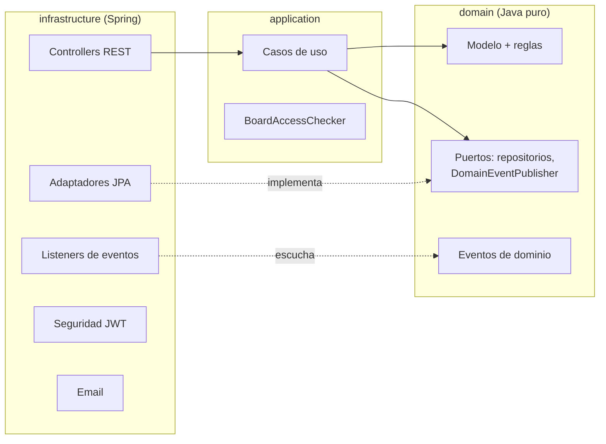
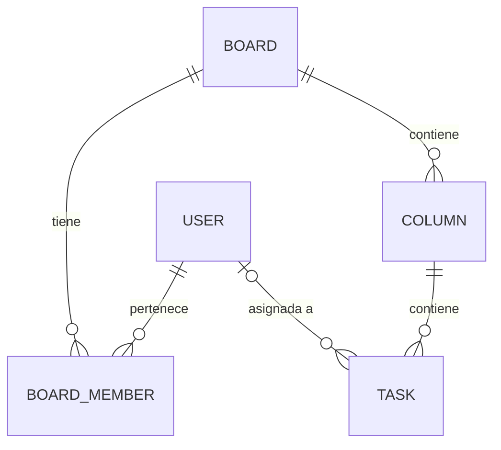

# Task Manager API

API REST de un gestor de tareas estilo Trello: tableros compartidos, columnas, tareas asignables y un historial de auditoría. Está construida con **Spring Boot 4** siguiendo **arquitectura hexagonal** (puertos y adaptadores).

El frontend en React que la consume está en **[task-manager-frontend](https://github.com/janlo-dev/task-manager-frontend)**.

**Contenido:**
[Stack](#stack) ·
[Arquitectura](#arquitectura-hexagonal) ·
[Modelo de dominio](#modelo-de-dominio) ·
[Seguridad](#seguridad) ·
[Endpoints](#endpoints) ·
[Arranque en local](#arranque-en-local) ·
[Testing](#testing) ·
[Decisiones de diseño](#decisiones-de-diseño) ·
[Mejoras futuras](#pendiente--mejoras-futuras)

---

## Stack

| Área | Tecnología |
|---|---|
| Lenguaje | Java 21 |
| Framework | Spring Boot 4.1 (Spring MVC, Spring Security, Spring Data JPA) |
| Persistencia | MySQL (Hibernate); H2 en memoria para los tests |
| Autenticación | JWT (`jjwt` 0.12), contraseñas con BCrypt |
| Email | Spring Mail + plantillas **Thymeleaf** (HTML + texto plano) |
| Desarrollo | **MailHog** (servidor SMTP falso) vía Docker |
| Tests | JUnit 5, AssertJ, Mockito, `@DataJpaTest`, MockMvc |
| Build | Maven (wrapper incluido) |

---

## Arquitectura hexagonal

El código está separado en tres capas con una regla de dependencia estricta: **las dependencias solo apuntan hacia dentro**. `domain` no conoce a nadie, `application` solo conoce `domain`, e `infrastructure` conoce ambas y es la única capa que usa Spring.



| Capa | Contenido | Dependencias |
|---|---|---|
| **domain** | Entidades con sus invariantes (`Board`, `Column`, `Task`, `User`, `BoardMember`), eventos de dominio, excepciones y los **puertos de salida**: interfaces de repositorio y `DomainEventPublisher`. | Ninguna (ni Spring ni JPA) |
| **application** | Un **caso de uso por operación** (`CreateTaskUseCase`, `MoveTaskUseCase`…), DTOs de entrada/salida y `BoardAccessChecker`. Orquesta el dominio: carga, comprueba permisos, muta, guarda y publica eventos. | Solo `domain` |
| **infrastructure** | Adaptadores: controllers REST, entidades JPA y repositorios que implementan los puertos, mappers entidad⇄dominio, seguridad JWT, listeners de eventos, envío de email y el manejo global de errores. | `application` + `domain` + Spring |

Los casos de uso son **clases Java planas, sin anotaciones de Spring**. Se registran como beans a mano en `infrastructure/config/UseCaseConfig`, de modo que ni `application` ni `domain` importan nada de Spring. Por eso se pueden testear con Mockito sin levantar ningún contexto.

### Eventos de dominio para las cascadas

Borrar un tablero implica borrar sus columnas, sus tareas y sus membresías. En lugar de meter toda esa lógica en `DeleteBoardUseCase`, el caso de uso hace solo su trabajo (comprobar permisos y borrar el tablero) y **publica un evento**:

| Evento | Lo publica | Reacción (listener en `infrastructure/listener`) |
|---|---|---|
| `BoardDeletedEvent` | `DeleteBoardUseCase` | Borra las tareas y columnas del tablero y sus membresías |
| `ColumnDeletedEvent` | `DeleteColumnUseCase` | Borra las tareas de la columna |
| `BoardMemberRemovedEvent` | `RemoveBoardMemberUseCase` | Desasigna las tareas de ese tablero asignadas al miembro expulsado |
| `AuditDomainEvent` | Todos los casos de uso de escritura | Persiste un `AuditLog` |

Por qué se hizo así:

- **Cada caso de uso tiene una sola responsabilidad.** `DeleteBoardUseCase` no necesita depender de los repositorios de columnas, tareas y miembros solo para limpiar.
- **Se pueden añadir reacciones nuevas sin tocar los casos de uso.** La auditoría se añadió así: un listener más, sin que ningún caso de uso sepa que existe una tabla `audit_logs`.
- **El dominio sigue sin depender de Spring.** Los casos de uso publican a través del puerto `DomainEventPublisher`, y solo el adaptador `SpringDomainEventPublisher` usa el `ApplicationEventPublisher` de Spring.

Los listeners son síncronos (`@EventListener`), así que la cascada se ejecuta dentro de la misma petición. Tiene una limitación conocida, descrita en [mejoras futuras](#pendiente--mejoras-futuras).

### Estructura del código

```text
src/main/java/es/neila/daw/taskmanagerapi/
├── domain/
│   ├── model/          # Board, Column, Task, User, BoardMember, BoardRole, AuditLog
│   ├── repository/     # Puertos de persistencia (interfaces)
│   ├── port/           # DomainEventPublisher
│   ├── event/          # BoardDeleted, ColumnDeleted, BoardMemberRemoved, AuditDomainEvent
│   └── exception/      # UnauthorizedActionException
├── application/
│   ├── usecase/        # board/ column/ task/ user/ audit/ — un caso de uso por clase
│   ├── service/        # BoardAccessChecker
│   └── dto/            # Requests y responses
└── infrastructure/
    ├── controller/     # Adaptadores REST
    ├── repository/jpa/ # Entidades JPA + adaptadores que implementan los puertos
    ├── mapper/         # Entidad JPA ⇄ modelo de dominio
    ├── listener/       # Cascadas y auditoría (reaccionan a eventos)
    ├── event/          # SpringDomainEventPublisher
    ├── security/       # SecurityConfig, JwtAuthFilter, UserDetailsService
    ├── config/         # JwtService, beans de casos de uso, PasswordEncoder
    ├── email/          # EmailService (plantilla Thymeleaf)
    └── exception/      # GlobalExceptionHandler → 400 / 403
```

---

## Modelo de dominio



Las relaciones entre agregados son **solo por ID** (`Task.columnId`, `Column.boardId`…), sin asociaciones JPA. Cada agregado se carga y guarda por separado, y la integridad entre ellos la mantienen los casos de uso y los eventos de cascada.

| Entidad | Campos principales | Reglas que protege |
|---|---|---|
| **User** | `id`, `name`, `email` (único), `password` (BCrypt) | Nombre, email y contraseña no vacíos |
| **Board** | `id`, `userId` (propietario), `name`, `boardOrder` | Nombre no vacío, orden ≥ 0; `verifyCanManage(userId)` → solo el propietario |
| **BoardMember** | `boardId`, `userId`, `role` (`OWNER` / `MEMBER`) | Tablero, usuario y rol obligatorios |
| **Column** | `id`, `boardId`, `name`, `columnOrder` | Nombre no vacío, orden ≥ 0 |
| **Task** | `id`, `columnId`, `title`, `description`, `assignedUserId`, `createdAt`, `updatedAt` | Título no vacío; cada cambio actualiza `updatedAt` |

**Roles de tablero.** Al crear un tablero, su creador queda como `OWNER`. El propietario invita a otros usuarios por email como `MEMBER`. Los miembros trabajan con el contenido (columnas y tareas). Solo el propietario gestiona el tablero en sí: renombrarlo, reordenarlo, borrarlo, invitar y expulsar miembros. Las tareas solo se pueden asignar a miembros del tablero.

### Auditoría (`AuditLog`)

Cada operación de escritura genera un registro con qué entidad cambió (`entityId`, `entityType`), qué acción (`CREATED`, `RENAMED`, `MOVED`, `ASSIGNED`, `DELETED`…), quién la hizo y cuándo.

Cada registro guarda también el **`boardId`** del tablero al que pertenecía la entidad. Así se resuelven dos requisitos a la vez:

- **Se puede consultar el historial de algo ya borrado.** Una tarea eliminada no existe, así que no se podría averiguar a qué tablero pertenecía para comprobar permisos. El `boardId` guardado en el propio registro lo permite.
- **No se filtran datos de tableros ajenos.** Los registros contienen títulos, descripciones y emails, así que solo los ven los miembros de ese tablero. La actividad de un usuario (`/api/audit/user/{id}`) solo la puede consultar él mismo.

Los registros anteriores a este cambio no tienen `boardId`. Se **deniegan por defecto**: con datos incompletos es más seguro no mostrarlos que arriesgar una fuga.

---

## Seguridad

### Autenticación con JWT

1. `POST /api/auth/register` o `/api/auth/login` devuelven un token JWT firmado con HMAC-SHA. Caduca a las 24 h.
2. El cliente lo envía en cada petición: `Authorization: Bearer <token>`.
3. `JwtAuthFilter` valida la firma y la caducidad, carga el usuario y lo deja en el `SecurityContext`. La API es **stateless**: no hay sesión en servidor.

**El `subject` del token es el UUID del usuario, no su email:**

- **El email puede cambiar** (`PUT /api/users/email`), y un token con el email como identidad dejaría de apuntar al usuario correcto o, peor, podría acabar apuntando a otra cuenta que registrase ese email después.
- **El UUID es el identificador interno estable.** Los casos de uso reciben directamente `UUID performedByUserId`, sin buscar primero al usuario por email.
- **Un JWT no está cifrado, solo firmado.** Cualquiera puede decodificar su contenido, así que es mejor no meter en él datos personales como el email.

### 401 frente a 403

| Código | Significado | Cuándo |
|---|---|---|
| **401 Unauthorized** | No sé quién eres | Sin token, token inválido o caducado |
| **403 Forbidden** | Sé quién eres, pero no puedes hacer esto | Autenticado, pero no eres miembro o propietario del tablero |
| **400 Bad Request** | Petición inválida | Reglas de dominio violadas (nombre vacío, email ya registrado…) o recurso inexistente |

Los errores se devuelven como `{"error": "mensaje"}` desde `GlobalExceptionHandler`. Distinguir 401 de 403 permite al frontend saber cuándo toca volver al login (401) y cuándo mostrar "sin permiso" (403).

### Autorización por tablero

La autorización no usa roles globales de Spring Security. Depende del **tablero**, y se comprueba en la capa de aplicación con dos mecanismos:

| Nivel | Mecanismo | Protege |
|---|---|---|
| **Miembro** (cualquier rol) | `BoardAccessChecker.verifyCanEditContent(boardId, userId)`: comprueba que existe un `BoardMember` para ese usuario y tablero | Lectura y edición de columnas y tareas, lista de miembros, auditoría del tablero |
| **Propietario** | `Board.verifyCanManage(userId)`: regla de la propia entidad, compara con `Board.userId` | Renombrar, reordenar y borrar el tablero; invitar y expulsar miembros |

El propietario también tiene su fila `BoardMember` con rol `OWNER`, así que pasa las dos comprobaciones. Las operaciones sobre el propio usuario (renombrarse, cambiar el email) usan siempre el usuario del token, nunca un id enviado en el cuerpo de la petición.

---

## Endpoints

Todos, excepto `/api/auth/**`, requieren `Authorization: Bearer <token>`.

| Recurso | Endpoint | Descripción | Permiso |
|---|---|---|---|
| **Auth** | `POST /api/auth/register` | Crea la cuenta, envía el email de bienvenida y devuelve el token | Público |
| | `POST /api/auth/login` | Devuelve `{ userId, accessToken }` | Público |
| **Boards** | `POST /api/boards` | Crea un tablero (el creador queda como `OWNER`) | Autenticado |
| | `GET /api/boards/me` | Tableros en los que participa el usuario | Autenticado |
| | `PUT /api/boards/rename` · `PUT /api/boards/order` | Renombrar / reordenar | Propietario |
| | `DELETE /api/boards/{id}` | Borra el tablero y en cascada sus columnas, tareas y miembros | Propietario |
| **Miembros** | `POST /api/boards/members/invite` | Invita a un usuario por email | Propietario |
| | `GET /api/boards/{boardId}/members` | Miembros con nombre, email y rol | Miembro |
| | `DELETE /api/boards/{boardId}/members/{userId}` | Expulsa y desasigna sus tareas en ese tablero | Propietario |
| **Columns** | `GET /api/columns/board/{boardId}` | Columnas ordenadas por `columnOrder` | Miembro |
| | `POST /api/columns` · `PUT /api/columns/rename` | Crear / renombrar | Miembro |
| | `PUT /api/columns/order` | Mueve la columna y recoloca las demás | Miembro |
| | `DELETE /api/columns/{id}` | Borra la columna y sus tareas | Miembro |
| **Tasks** | `GET /api/tasks?columnId=` | Tareas de una columna, por fecha de creación | Miembro |
| | `POST /api/tasks` · `PUT /api/tasks/rename` · `PUT /api/tasks/description` | Crear / editar | Miembro |
| | `PUT /api/tasks/move` | Mueve a otra columna **del mismo tablero** | Miembro |
| | `PUT /api/tasks/assign` | Asigna a un miembro del tablero | Miembro |
| | `DELETE /api/tasks/{taskId}` | Borra la tarea | Miembro |
| **Usuario** | `GET /api/users/me` | Tareas asignadas al usuario, con su columna y tablero | Autenticado |
| | `PUT /api/users/rename` · `PUT /api/users/email` | Cambia el nombre o el email del **propio** usuario | Autenticado |
| **Auditoría** | `GET /api/audit/entity/{entityId}` | Historial de una entidad, aunque esté borrada | Miembro del tablero |
| | `GET /api/audit/user/{userId}` | Actividad de un usuario | Solo él mismo |

Ejemplo de flujo:

```bash
# 1. Registro (devuelve userId + accessToken)
curl -X POST localhost:8080/api/auth/register -H 'Content-Type: application/json' \
     -d '{"name":"Ana","email":"ana@example.com","password":"secreto123"}'

# 2. Crear un tablero con el token
curl -X POST localhost:8080/api/boards -H "Authorization: Bearer $TOKEN" \
     -H 'Content-Type: application/json' -d '{"name":"Sprint 1","boardOrder":0}'
```

---

## Arranque en local

### Requisitos

- **Java 21**. Maven no hace falta: se usa el wrapper `./mvnw`.
- **MySQL** en `localhost:3306` con una base de datos llamada `taskmanager` (desarrollado con MySQL 9).
- **Docker**, para MailHog.

### 1. Base de datos

```sql
CREATE DATABASE taskmanager;
```

Las tablas las crea y actualiza Hibernate al arrancar (`spring.jpa.hibernate.ddl-auto=update`). El usuario de conexión configurado es `root`. Si usas otro, cámbialo en `application.properties` o sobrescríbelo con la variable `SPRING_DATASOURCE_USERNAME`.

### 2. MailHog (SMTP de desarrollo)

```bash
docker run -d --name mailhog -p 1025:1025 -p 8025:8025 mailhog/mailhog
```

La aplicación envía el correo por SMTP a `localhost:1025`, y los mensajes se ven en **http://localhost:8025**. Si MailHog no está en marcha, el registro funciona igual: el fallo del email se registra en el log y no interrumpe la petición.

### 3. Variables de entorno

`application.properties` no contiene secretos. Los lee de estas variables:

| Variable | Uso | Requisito |
|---|---|---|
| `DB_PASSWORD` | Contraseña del usuario de MySQL | — |
| `JWT_SECRET` | Clave de firma HMAC de los tokens | **Mínimo 32 caracteres** (256 bits). La aplicación arranca igualmente con una clave más corta, pero el login y el registro fallarán al generar el token |

```bash
# Linux / macOS
export DB_PASSWORD='...'
export JWT_SECRET='una-clave-larga-y-aleatoria-de-al-menos-32-caracteres'
```

```powershell
# Windows (PowerShell)
$env:DB_PASSWORD = '...'
$env:JWT_SECRET  = 'una-clave-larga-y-aleatoria-de-al-menos-32-caracteres'
```

En IntelliJ también se pueden definir en *Run Configuration → Environment variables*.

### 4. Arrancar

```bash
./mvnw spring-boot:run        # Windows: mvnw.cmd spring-boot:run
```

La API queda en **http://localhost:8080**. CORS está abierto para `http://localhost:5173`, el servidor de desarrollo del frontend.

---

## Testing

```bash
./mvnw test
```

**213 tests**, sin dependencias externas: no necesitan MySQL, MailHog ni variables de entorno. `src/test/resources/application.properties` sustituye la configuración por una base de datos **H2 en memoria en modo MySQL** y una clave JWT solo para tests.

| Nivel | Tests | Herramientas | Qué aporta |
|---|---:|---|---|
| **Dominio** | 69 | JUnit 5 + AssertJ | Las invariantes de las entidades: nombres vacíos, órdenes negativos, `updatedAt` en cada cambio, `verifyCanManage`. Java puro: se ejecutan en milisegundos. |
| **Casos de uso** | 96 | Mockito | La orquestación y los permisos. Cada caso de uso se prueba con los repositorios simulados. En cada error se verifica que **no se guardó nada ni se publicó ningún evento**. También se comprueba la lógica de reordenar columnas y que cada evento lleva el `boardId` correcto. |
| **Repositorios** | 36 | `@DataJpaTest` + H2 | Los adaptadores JPA reales con sus mappers: consultas derivadas y JPQL, borrados y actualizaciones masivas (con `flush`/`clear` para no leer de la caché de Hibernate) y el índice único de email. |
| **Seguridad HTTP** | 7 | `@SpringBootTest` + MockMvc | La cadena de seguridad completa: 401 sin token o con token inválido, 403 sin permiso, email duplicado en el registro, registro que sobrevive a un fallo del SMTP. |
| **Email** | 4 | Mockito + Thymeleaf real | Destinatario y asunto, versiones HTML y texto plano, **escape del nombre** (evita inyección de HTML) y conversión de errores. |
| **Contexto** | 1 | `@SpringBootTest` | Que la aplicación arranca con toda su configuración. |

**Por qué no hay una batería end-to-end completa.** Los permisos, las cascadas y la auditoría a través de HTTP se cubren por partes: los casos de uso con Mockito, las consultas con `@DataJpaTest`, y la cadena de seguridad con los tests HTTP. Una capa `@SpringBootTest` que recorriera todos los endpoints repetiría en gran parte esa cobertura con tests más lentos y frágiles. Se dejó fuera como **decisión de alcance**, no por una limitación técnica: la infraestructura para escribirla ya existe (`AuthSecurityIntegrationTest`).

---

## Decisiones de diseño

**El `subject` del JWT es el UUID del usuario, no su email.** Es un identificador estable aunque el usuario cambie de email, no expone datos personales en un token que cualquiera puede decodificar, y es justo lo que necesitan los casos de uso. Detalles en [Seguridad](#autenticación-con-jwt).

**H2 en modo MySQL en lugar de Testcontainers.** Los tests de repositorio usan H2 en memoria con `MODE=MySQL`. Así `./mvnw test` funciona en cualquier máquina sin Docker y tarda segundos. La contrapartida es que H2 **no es MySQL**: por ejemplo, H2 distingue mayúsculas al comparar texto y la colación por defecto de MySQL no, y no reproduce todas las particularidades del dialecto. Un fallo que solo ocurra en MySQL no lo detectarían estos tests. Testcontainers con un MySQL real daría esa garantía a cambio de exigir Docker para ejecutar los tests.

**Las tareas se ordenan por fecha de creación, no se reordenan a mano.** Dentro de una columna, las tareas salen por `createdAt` ascendente, como un backlog de sprint: lo primero que entra es lo primero que se atiende. Así no hace falta mantener un campo de posición ni recolocar las demás tareas en cada movimiento. Las **columnas** sí se reordenan (`PUT /api/columns/order`), y el caso de uso desplaza las columnas intermedias para que dos columnas no queden con la misma posición.

**Mover tareas solo dentro del mismo tablero.** Moverla a otro tablero podría dejarla asignada a alguien que no es miembro de ese tablero. Si se quiere permitir en el futuro, será una funcionalidad aparte con su propia lógica de desasignación.

**Email de bienvenida no crítico.** El correo se envía como HTML con versión en texto plano (plantilla Thymeleaf con tablas y estilos en línea, para que se vea bien en los clientes de correo). Si el envío falla, se registra en el log y el registro de la cuenta se completa igualmente.

---

## Pendiente / mejoras futuras

- **Atomicidad de las cascadas.** Los casos de uso no son transaccionales: el borrado principal se confirma primero, y después el listener de cascada se ejecuta en su propia transacción. Si el listener falla (por ejemplo en `RemoveBoardMemberUseCase`), los datos quedan a medias. Hay dos opciones:
  - añadir `@Transactional` al caso de uso, lo más simple, pero rompe la regla de que `application` no importa Spring
  - definir un puerto `TransactionRunner` en `domain`, implementado en infraestructura con el `TransactionTemplate` de Spring, que mantiene la arquitectura hexagonal pura
- **Refresh tokens.** Ahora hay un único token de acceso de 24 h. Con tokens de acceso cortos y un refresh token se podrían revocar sesiones y reducir el riesgo si un token se filtra.
- **Migraciones con Flyway.** Hoy el esquema lo genera Hibernate con `ddl-auto=update`. Con Flyway los cambios de esquema quedarían versionados y serían reproducibles, que es lo necesario para producción.
- **Despliegue con Docker / Kubernetes.** Un `Dockerfile` para la API y un `docker-compose` con MySQL y MailHog permitirían levantar todo el entorno con un comando; más adelante, manifiestos de Kubernetes para el despliegue.

---

## Autor

**Juan Antonio Neila Lorenzo**
